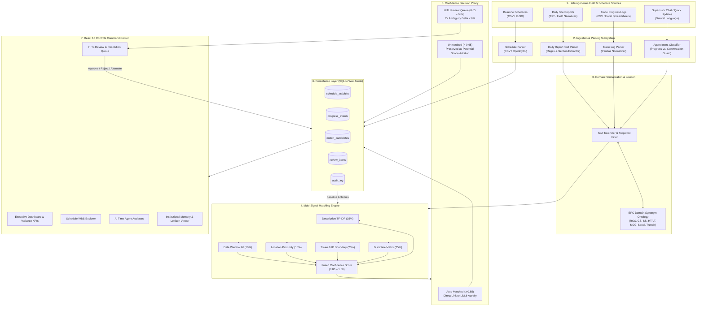

# InfraSync AI

> **Intelligent Data Capture & Schedule-Linking Layer for Infrastructure Project Management: Real-Time Actual Progress Tracking (Planning-to-Execution Bridge).**

[](https://www.python.org/)
[](https://fastapi.tiangolo.com/)
[](https://react.dev/)
[](https://www.typescriptlang.org/)
[]()
[]()

---

## 🎯 Problem Statement

In large-scale infrastructure, Oil & Gas, and Engineering, Procurement, and Construction (EPC) projects, capital investments routinely suffer from chronic delays and cost overruns. A primary root cause is the **disconnect between high-level planning and on-site actual execution**:

- **Planning vs. Actual Execution Gap**: While project planners maintain detailed critical-path schedules in systems like Oracle Primavera P6 or Microsoft Project, actual site execution unfolds across hundreds of dispersed field crews, subcontractors, and foremen.
- **The L1–L6 Schedule Breakdown**: Master schedules follow a Work Breakdown Structure (WBS) spanning Level 1 (Executive Milestones) down to Level 5/6 (granular work packages, specific spool erections, foundation pours, or cable pulls). Field reporting rarely references formal L5/L6 Activity IDs.
- **Disconnected Field Reporting**: Progress is captured haphazardly through unstructured daily progress reports (DPRs in text format), discipline-specific spreadsheets (CSV/XLSX), site diaries, and shift notes.
- **Vague & Inconsistent Terminology**: Field supervisors use site slang, discipline shorthand, and trade abbreviations (e.g., *"pulled 400m HT cable"*, *"poured second lift for C-101 foundation"*, *"bolted spools at Rack PR-01"*) that do not match the formal descriptions in the schedule baseline.
- **Delayed & Error-Prone Reconciliation**: Project controls engineers must manually read hundreds of pages of daily reports and cross-reference activities line-by-line. This manual linking process creates a 2- to 4-week reporting lag, obscuring critical-path variances until project delays become irreversible.

---

## 💡 Solution

**InfraSync AI** serves as an intelligent, automated bridge connecting unstructured field progress capture directly to baseline project schedules:

1. **Heterogeneous Ingestion**: Ingests baseline schedules (CSV, XLSX) alongside field execution inputs (unstructured TXT daily reports, CSV discipline logs, and Excel spreadsheets).
2. **Domain-Aware Normalization**: Automatically normalizes infrastructure trade terminology, equipment codes, abbreviations, and engineering synonyms using an embedded EPC lexicon.
3. **Multi-Signal Matching Engine**: Combines 5 deterministic similarity dimensions—TF-IDF description cosine similarity, discipline compatibility, Activity ID/token boundaries, location proximity, and planned date window alignment.
4. **Policy-Driven Decision Routing**: Automatically links high-confidence matches ($\ge 0.85$), flags ambiguous or borderline matches ($0.65 - 0.84$) into a Human-in-the-Loop (HITL) Review Queue, and retains low-confidence events ($< 0.65$) as unmatched potential scope additions without discarding them.
5. **Interactive Controls Command Center**: Provides project managers with real-time dashboard analytics, schedule variance tracking, an AI Time Agent assistant for field logging, and an immutable audit trail.

---

## 🚀 Key Features

- **L5/L6 Schedule Baseline Explorer**:
  - Ingestion of CSV and Excel (`.xlsx`) schedule exports with full WBS hierarchy.
  - Drill-down views across disciplines (Piping, Civil, Electrical, Instrumentation, Mechanical, Structural).
  - Tracking of planned start, planned finish, duration, location, and activity lifecycle states (`not_started`, `in_progress`, `completed`).

- **Heterogeneous Progress Capture**:
  - Unstructured daily site report parser (TXT) extracting dates, discipline sections, manpower, weather, and execution work items.
  - Structured trade progress log parsers (CSV and XLSX).
  - Ingestion sandbox with "Parse & Preview" mode to inspect extracted entities before database commit.

- **Multi-Signal Intelligent Matching Engine**:
  - 5-factor weighted scoring model specifically tuned for engineering deliverables.
  - Ambiguity detection ($\Delta \le 8\%$) flagging competing activities for human review.
  - Zero external dependency: Operates out-of-the-box with a deterministic local NLP provider.

- **Human-in-the-Loop (HITL) Review Queue**:
  - Dedicated queue for medium-confidence and ambiguous candidate matches.
  - Granular score breakdown (Description, Discipline, Token/ID, Location, Date).
  - Alternative candidate switcher allowing reviewers to reassign progress to candidate activities.
  - One-click approval and rejection with reviewer notes and audit logging.

- **AI Time Agent Conversational Assistant**:
  - Natural language querying of schedule activities, active delays, and progress status.
  - Field supervisor logging interface that extracts structured progress events from conversational chat updates.
  - Strict intent classifier preventing conversational greetings and non-progress messages from creating phantom database records.

- **Institutional Memory & Domain Lexicon**:
  - Searchable EPC domain ontology mapping engineering abbreviations (e.g., RCC, PCC, CS, SS, HT, LT, MCC, VFD, JB, NDT, RT) to canonical terms.
  - Historical ledger of learned matches and human-confirmed mappings.
  - Aggregate accuracy statistics tracking auto-matches vs. human interventions.

- **Executive Controls Dashboard**:
  - KPI cards tracking Total Activities, Ingested Events, Linkage Rate %, and Delayed Tasks.
  - Interactive Recharts discipline coverage comparison (Planned vs. Actual).
  - Confidence score distribution pie charts.
  - Schedule variance analysis table flagging days ahead or behind schedule.

- **Cryptographic-Style Provenance & Audit Trail**:
  - Timestamped, immutable audit log recording every ingestion, matching run, manual approval, rejection, and agent interaction.

---

## 🏗️ System Architecture



---

## 🔄 How It Works

```
Field Progress Inputs
        │
        ▼
[ 1. Ingest & Normalize ]  ──> Extracts dates, disciplines, quantities, locations, and actions
        │
        ▼
[ 2. Build Schedule Corpus ] ──> Indexes baseline activity descriptions using TF-IDF vectorization
        │
        ▼
[ 3. Multi-Signal Scoring ]  ──> Evaluates description, discipline, ID, location, and date alignment
        │
        ▼
[ 4. Ambiguity Evaluation ]  ──> Checks delta between top candidate scores (flags if Δ ≤ 8%)
        │
        ├─────────────────────────────┬─────────────────────────────┐
        ▼                             ▼                             ▼
Score ≥ 0.85 (No Ambiguity)    0.65 ≤ Score < 0.85 (or Δ ≤ 8%)    Score < 0.65
[ Auto-Link Activity ]         [ Human-in-the-Loop Queue ]       [ Retain Unmatched ]
        │                             │                             │
        └─────────────────────────────┼─────────────────────────────┘
                                      ▼
                        [ Schedule Actuals Updated ]
                                      │
                                      ▼
                        [ Audit Logged & Visualized ]
```

1. **Step 1: Baseline Ingestion**: The project manager uploads the approved baseline schedule (`sample_schedule.csv` or `.xlsx`). Activities with WBS codes, planned start/finish dates, and discipline designations are stored.
2. **Step 2: Progress Capture**: Field supervisors upload unstructured daily reports (`daily_report_civil.txt`, `daily_report_piping.txt`, etc.) or trade CSVs. The parsers isolate discrete work execution events.
3. **Step 3: Domain Terminology Normalization**: Abbreviations and trade terms are expanded via the domain lexicon (e.g., *"rcc foundation"* expands to *"reinforced concrete foundation"*, *"hydrotest"* expands to *"hydrostatic pressure testing"*).
4. **Step 4: Multi-Signal Scoring**: The matching engine evaluates each event against schedule activities using the 5-signal formula.
5. **Step 5: Confidence Routing**:
   - **Score $\ge 0.85$**: Automatically linked to the activity; actual progress date and status are updated.
   - **Score $0.65 - 0.84$ or Ambiguity Delta $\le 0.08$**: Pushed to the Review Queue with score breakdown and alternative candidates.
   - **Score $< 0.65$**: Retained in the database as unmatched for review (never dropped).
6. **Step 6: Human Verification**: The project controls engineer reviews pending items in the Review Queue and approves the match or assigns an alternate candidate.
7. **Step 7: Schedule Variance Calculation**: Linked activities update their execution actuals, enabling instant planned vs. actual variance tracking across the dashboard.
8. **Step 8: Provenance Recording**: All system and user actions are recorded with timestamps, user IDs, and before/after metadata in `audit_log`.

---

## 🧠 AI / Intelligent Matching

The matching subsystem in InfraSync AI is designed as a **deterministic, transparent, and explainable multi-signal AI engine**. It runs locally without requiring external cloud LLM API keys.

### 1. Mathematical Formulation

$$\text{Confidence Score} = w_{\text{desc}} \cdot S_{\text{desc}} + w_{\text{disc}} \cdot S_{\text{disc}} + w_{\text{token}} \cdot S_{\text{token}} + w_{\text{loc}} \cdot S_{\text{loc}} + w_{\text{date}} \cdot S_{\text{date}}$$

Where the calibrated weights are:

| Signal Weight | Symbol | Default Value | Description |
|---|---|---|---|
| **Description Similarity** | $w_{\text{desc}}$ | **0.35** (35%) | TF-IDF cosine similarity combined with Jaccard token overlap |
| **Discipline Compatibility** | $w_{\text{disc}}$ | **0.25** (25%) | Matrix matching discipline alignment between trade report and schedule |
| **Token & ID Boundaries** | $w_{\text{token}}$ | **0.20** (20%) | Exact Activity ID boundary matching and key token overlap |
| **Location Similarity** | $w_{\text{loc}}$ | **0.10** (10%) | Substring and SequenceMatcher fuzzy matching of physical areas |
| **Date Compatibility** | $w_{\text{date}}$ | **0.10** (10%) | Temporal compatibility of event date with planned schedule windows |

### 2. Signal Deep-Dive

- **Terminology Normalization & Lexicon**: Built-in EPC lexicon (`backend/ai/fallback.py`) handles common construction abbreviations:
  - Material types: `rcc` $\to$ reinforced concrete, `cs` $\to$ carbon steel, `ss` $\to$ stainless steel, `gi` $\to$ galvanized iron
  - Electrical: `ht`/`lt` $\to$ high/low tension, `mcc` $\to$ motor control center, `vfd` $\to$ variable frequency drive, `earthing` $\to$ grounding
  - Mechanical/Piping: `spool` $\to$ pipe spool, `hydrotest` $\to$ hydrostatic pressure testing, `bolting` $\to$ bolt-up
  - Civil: `earthwork` $\to$ excavation, `piling` $\to$ piling work heavy equipment
- **Discipline Compatibility Matrix**:
  - Exact match (`piping` $\leftrightarrow$ `piping`): `1.0`
  - Related discipline pairs (`piping` $\leftrightarrow$ `mechanical`, `electrical` $\leftrightarrow$ `instrumentation`, `civil` $\leftrightarrow$ `structural`): `0.6`
  - General scope: `0.7`
  - Discipline mismatch (`civil` $\leftrightarrow$ `electrical`): `0.1` (applies a strict penalty preventing false cross-trade links)
- **Token & Identifier Overlap**:
  - Regex word-boundary search (`\bPIP-001\b` or `\bPIP001\b`) guarantees that if an activity identifier appears in field text, it scores `1.0`.
  - Multi-term domain overlap provides scaling rewards when $\ge 3$ core nouns match.
- **Ambiguity Detection**:
  - If the top candidate and the runner-up candidate have scores within **$\Delta \le 8\%$** (`0.08`), the system treats the match as ambiguous and routes it to human review, even if the top score exceeds 0.85.

---

## 📊 Dashboard

The **Command Center Dashboard** (`frontend/src/pages/Dashboard.tsx`) aggregates project controls metrics in real time:

- **Executive KPI Cards**:
  - **Total Activities**: Total number of baseline schedule tasks loaded.
  - **Progress Events**: Cumulative site execution records extracted from all uploaded documents.
  - **Linkage Rate**: Percentage of events successfully mapped to schedule activities.
  - **Review Queue**: Current count of items awaiting supervisor sign-off.
  - **In Progress / Delayed**: Count of activities actively underway and tasks suffering schedule slippage.
- **Discipline Coverage Breakdown**: A multi-bar chart powered by Recharts visualizing scheduled activities versus matched progress across Piping, Civil, and Electrical disciplines.
- **Matching Confidence Breakdown**: A pie chart detailing the proportion of Auto-Matched ($\ge 0.85$), Review-Required ($0.65 - 0.84$), and Unmatched ($< 0.65$) events.
- **Schedule Activity Variance Analysis**: A dedicated table showing planned duration vs. actual execution start/finish dates, calculating variances in days and flagging slippage.
- **Interactive Quick-Run Actions**: Trigger background matching across all unprocessed events directly from the dashboard header.

---

## 📝 Review Queue

The **Human-in-the-Loop Review Queue** (`frontend/src/pages/ReviewQueue.tsx`) provides project controls teams with a rigorous verification workflow:

- **Filter & Search**: Filter review candidates by discipline or search by event text and Activity ID.
- **Side-by-Side Comparison**:
  - Left panel: Raw excerpt from the daily site diary or trade report with source document provenance and extraction date.
  - Right panel: Best matching schedule activity showing WBS code, discipline, planned duration, and location.
- **Score Breakdown Drawer**: Inspect each signal score individually (Description, Discipline, Token, Location, Date) to understand why the engine flagged the candidate.
- **Alternative Candidate Selection**: If the top recommendation is not the intended activity, reviewers can expand the top 5 candidates and select the correct activity with one click.
- **One-Click Actions**:
  - **Approve Match**: Commits the link, updates the schedule activity status (`in_progress` or `completed`), updates actual dates, and generates an audit log record.
  - **Reject Match**: Rejects the candidate link, returning the event to the unmatched pool with reviewer commentary.

---

## 🛠️ Technology Stack

| Layer | Technologies & Libraries | Version | Purpose |
|---|---|---|---|
| **Frontend Framework** | React | `^18.2.0` | Declarative user interface |
| **Language (Frontend)** | TypeScript | `^5.2.2` | Type-safe frontend component architecture |
| **Build Tool** | Vite | `^5.1.6` | Fast development server and production bundler |
| **Data Visualization** | Recharts | `^2.12.3` | Responsive charts (BarChart, PieChart, Tooltips) |
| **Icons & Styling** | Lucide React, Custom CSS | `^0.359.0` | Modern, clean UI styling and responsive layouts |
| **Backend Framework** | FastAPI | `>=0.110.0` | High-performance asynchronous REST API |
| **ASGI Server** | Uvicorn | `>=0.28.0` | Production ASGI web server |
| **Language (Backend)** | Python | `3.10+` (tested on `3.14`) | Core backend services, parsers, and AI engine |
| **Data Validation** | Pydantic | `>=2.6.0` | Strict request/response schemas and models |
| **Database & Storage** | SQLite (`sqlite3`) | Built-in | Relational storage with foreign keys & WAL mode |
| **AI / NLP Components** | Scikit-learn | `>=1.4.0` | TF-IDF vectorization and cosine similarity |
| **Spreadsheet Parsers** | Pandas, OpenPyXL | `>=2.2.0`, `>=3.1.2` | Parsing and normalizing CSV and Excel (`.xlsx`) files |
| **File Ingestion** | Python-Multipart | `>=0.0.9` | Streaming multi-part form data uploads |
| **HTTP Client** | HTTPX | `>=0.27.0` | Asynchronous HTTP client for API testing |
| **Testing Framework** | Pytest | `>=8.0.0` | Automated test suite (41 unit and integration tests) |

---

## 📁 Project Structure

```
InfraSync-AI/
├── .env.example                     # Environment variables configuration template
├── .gitignore                       # Git ignore configuration
├── README.md                        # Project documentation
├── backend/                         # FastAPI backend service
│   ├── ai/                          # AI & intelligent matching subsystem
│   │   ├── __init__.py
│   │   ├── embeddings.py            # Similarity metric calculators (discipline, location, date)
│   │   ├── fallback.py              # Deterministic TF-IDF, synonym lexicon & domain matching
│   │   └── provider.py              # AI provider abstraction interface
│   ├── config.py                    # Application settings loaded from environment
│   ├── database/                    # SQLite database models, schemas & seed data
│   │   ├── __init__.py
│   │   ├── .gitkeep
│   │   ├── connection.py            # SQLite database connection & schema initialization
│   │   ├── models.py                # Pydantic schemas and database models
│   │   └── seed.py                  # Initial baseline seed activities & sample events
│   ├── main.py                      # FastAPI application entry point & router registration
│   ├── parsers/                     # Ingestion parsers for heterogeneous inputs
│   │   ├── __init__.py
│   │   ├── csv_parser.py            # Schedule and progress CSV parsers
│   │   ├── txt_parser.py            # Daily site report unstructured text parser
│   │   └── xlsx_parser.py           # Excel (.xlsx) schedule and progress parser
│   ├── requirements.txt             # Python dependencies
│   ├── routers/                     # REST API route handlers
│   │   ├── __init__.py
│   │   ├── agent.py                 # AI Time Agent & Institutional Memory endpoints
│   │   ├── audit.py                 # System audit trail endpoints
│   │   ├── dashboard.py             # Executive dashboard metrics endpoint
│   │   ├── matching.py              # Matching engine & review queue endpoints
│   │   ├── progress.py              # Progress event ingestion & query endpoints
│   │   └── schedule.py              # Schedule baseline upload & query endpoints
│   └── services/                    # Business logic and domain service layer
│       ├── __init__.py
│       ├── audit_service.py         # Audit logging service
│       ├── dashboard_service.py     # Aggregated metrics calculation service
│       ├── matching_service.py      # Multi-signal matching engine & confidence policy
│       ├── progress_service.py      # Progress event persistence & status management
│       └── schedule_service.py      # Schedule baseline persistence & query service
├── data/                            # Sample test datasets for demonstrations
│   ├── daily_report_civil.txt       # Sample civil unstructured daily report
│   ├── daily_report_electrical.txt  # Sample electrical unstructured daily report
│   ├── daily_report_piping.txt      # Sample piping unstructured daily report
│   ├── progress_civil.csv           # Sample civil trade progress spreadsheet
│   ├── progress_piping.csv          # Sample piping trade progress spreadsheet
│   ├── sample_schedule.csv          # Sample 30-activity baseline schedule (CSV)
│   └── sample_schedule.xlsx         # Sample baseline schedule (Excel)
├── docs/                            # Documentation assets
│   ├── ARCHITECTURE.md              # Detailed architecture specifications
│   ├── SIH26122_Project_User_Manual.md # Comprehensive user manual
│   ├── SIH26122_Project_User_Manual.pdf # Printable PDF user manual
│   └── images/                      # Application UI screenshots
├── frontend/                        # React 18 TypeScript frontend
│   ├── index.html                   # HTML entry point
│   ├── package.json                 # Node dependencies & npm scripts
│   ├── package-lock.json
│   ├── tsconfig.json                # TypeScript compiler configuration
│   ├── tsconfig.node.json
│   ├── vite.config.ts               # Vite configuration
│   └── src/
│       ├── App.tsx                  # Top-level application router & layout state
│       ├── main.tsx                 # React DOM mount point
│       ├── api/
│       │   └── client.ts            # Centralized typed HTTP API client
│       ├── components/              # Modular UI components
│       │   ├── ActivityDetailDrawer.tsx # Slide-out drawer for schedule activity details
│       │   ├── ConfidenceBadge.tsx  # Color-coded badge for match confidence
│       │   ├── EventDetailDrawer.tsx    # Slide-out drawer for progress event details
│       │   ├── FileUpload.tsx       # Drag-and-drop file upload component
│       │   ├── GlobalSearchModal.tsx# Universal search modal (Ctrl+K / Cmd+K)
│       │   ├── Layout.tsx           # Page structure wrapper
│       │   ├── Sidebar.tsx          # Navigation sidebar
│       │   ├── StatsCard.tsx        # KPI statistics card
│       │   └── ToastContext.tsx     # Toast notification system
│       ├── pages/                   # Application views
│       │   ├── AITimeAgent.tsx      # Natural language assistant & progress logging
│       │   ├── Dashboard.tsx        # Executive command center with Recharts
│       │   ├── DataIngestion.tsx    # File upload and parse-preview sandbox
│       │   ├── InstitutionalMemory.tsx # Domain lexicon and learned matches view
│       │   ├── ProgressEvents.tsx   # Captured site events ledger
│       │   ├── ReviewQueue.tsx      # HITL review queue with approval workflows
│       │   └── ScheduleExplorer.tsx # WBS schedule activity explorer
│       ├── styles/
│       │   └── index.css            # Custom CSS design system
│       └── types/
│           └── index.ts             # Shared TypeScript interface definitions
├── tests/                           # Pytest automated test suite
│   ├── conftest.py                  # Pytest fixtures and test database setup
│   ├── test_adversarial.py          # Adversarial input handling and boundary tests
│   ├── test_agent_intent.py         # AI Time Agent intent classifier guard tests
│   ├── test_ambiguity.py            # Ambiguity detection & alternative candidate tests
│   ├── test_api.py                  # End-to-end REST API endpoint tests
│   ├── test_deduplication.py        # Event deduplication & matching idempotency tests
│   ├── test_electrical_and_variance.py # Discipline parsing & schedule variance tests
│   ├── test_matching.py             # Multi-signal matching & approval workflow tests
│   └── test_parsers.py              # CSV, XLSX, and TXT parser unit tests
└── uploads/                         # Temporary runtime upload storage (.gitkeep)
```

---

## ⚙️ Installation

### 1. Prerequisites
- **Python 3.10+** (Tested on Python 3.14)
- **Node.js 18+** & **npm**
- **Git**

### 2. Clone Repository
```bash
git clone https://github.com/gantalasumanth18/InfraSync-AI.git
cd InfraSync-AI
```

### 3. Backend Setup
Create a Python virtual environment and install backend dependencies:
```bash
# Navigate to backend directory
cd backend

# Create virtual environment (optional but recommended)
python -m venv .venv

# Activate virtual environment
# Windows (PowerShell):
.venv\Scripts\Activate.ps1
# Linux / macOS:
source .venv/bin/activate

# Install required dependencies
python -m pip install -r requirements.txt
```

### 4. Frontend Setup
Install frontend dependencies via npm:
```bash
# Navigate to frontend directory from project root
cd ../frontend

# Install dependencies
npm install
```

### 5. Environment Configuration
Copy the `.env.example` template into `.env` at the project root if custom configuration is required:
```bash
# From project root
cp .env.example .env
```
*(The system runs out-of-the-box with default settings. No external API keys are required.)*

---

## ▶️ Running the Project

### 1. Start the Backend API Server
```bash
# From backend directory
cd backend
python -m uvicorn main:app --host 0.0.0.0 --port 8000 --reload
```
- The backend API will start at: `http://127.0.0.1:8000`
- Interactive Swagger API Documentation: `http://127.0.0.1:8000/docs`
- Health check: `http://127.0.0.1:8000/health`

### 2. Start the Frontend Development Server
In a separate terminal window:
```bash
# From frontend directory
cd frontend
npm run dev
```
- The frontend will start at: `http://localhost:5173`
- Open `http://localhost:5173` in your web browser.

---

## 🔌 API

InfraSync AI exposes a comprehensive RESTful API built with FastAPI:

| HTTP Method | Endpoint | Purpose |
|---|---|---|
| `GET` | `/health` | Check service health, active mode, and AI provider status |
| `POST` | `/api/v1/schedule/upload` | Upload and import baseline schedule (`.csv` or `.xlsx`) |
| `GET` | `/api/v1/schedule/activities` | Query schedule activities with optional discipline filter |
| `POST` | `/api/v1/progress/upload` | Ingest and store field progress files (`.csv`, `.xlsx`, or `.txt`) |
| `POST` | `/api/v1/progress/parse` | Parse progress file and preview extracted events without saving |
| `GET` | `/api/v1/progress` | Retrieve progress events with optional status and discipline filters |
| `POST` | `/api/v1/matching/run` | Execute multi-signal matching engine on all unlinked events |
| `GET` | `/api/v1/matching/review` | Retrieve pending items in the HITL review queue |
| `POST` | `/api/v1/matching/{match_id}/approve` | Approve a candidate match with optional notes or alternative choice |
| `POST` | `/api/v1/matching/{match_id}/reject` | Reject a candidate match with reviewer notes |
| `GET` | `/api/v1/dashboard` | Fetch aggregated dashboard KPIs, discipline distributions, and variances |
| `GET` | `/api/v1/audit` | Fetch system audit trail logs with optional entity filter |
| `POST` | `/api/v1/agent/query` | Natural language project queries answered from database state |
| `POST` | `/api/v1/agent/log-progress` | Extract draft progress events from natural language field updates |
| `POST` | `/api/v1/agent/confirm-progress`| Confirm extracted draft event, update schedule, and log audit trail |
| `GET` | `/api/v1/memory` | Retrieve learned terminology mappings, matching statistics, and lexicon |

---

## 📥 Data Flow / Input Format

### 1. Baseline Schedule Input (`sample_schedule.csv` / `.xlsx`)
Schedules represent the master plan activities down to Level 5/6:

```csv
activity_id,wbs,discipline,description,planned_start,planned_finish,location,status
PIP-001,1.1.1,piping,8 inch carbon steel pipe spool fabrication,2026-07-01,2026-08-15,Fab Yard Area A,in_progress
PIP-002,1.1.2,piping,6 inch stainless steel pipe installation - Unit 100,2026-07-15,2026-09-01,Unit 100 - Rack R1,not_started
CIV-001,2.1.1,civil,Reinforced concrete foundation for compressor C-101,2026-06-15,2026-08-01,Compressor Area,in_progress
ELE-001,3.1.1,electrical,Main substation transformer installation,2026-07-15,2026-09-01,Substation 1,not_started
```

### 2. Trade Progress Spreadsheet (`progress_civil.csv`)
Discipline logs submitted by site foremen or subcontractors:

```csv
report_date,trade,ref_no,work_description,qty_done,uom,cumulative_pct,area,notes
2026-09-15,civil,CIV-001,RCC foundation compressor C-101 second lift concrete pour,1,lift,85,Compressor Area,Curing in progress
2026-09-15,civil,CIV-002,Earth removal and levelling Unit 200 plot,2800,cum,95,Unit 200 Plot,Dewatering deployed
2026-09-15,civil,CIV-003,Driven pile installation heavy equipment area,45,piles,56,Equipment Area EA-1,On track
```

### 3. Daily Site Progress Narrative (`daily_report_piping.txt`)
Unstructured natural language daily progress diaries:

```text
DAILY PROGRESS REPORT — PIPING DISCIPLINE
Project: Oil India Greenfield Expansion
Date: 2026-09-15
Prepared by: Piping Superintendent

WEATHER: Clear, 32°C, No rain delays
MANPOWER: Pipe Fitters: 24, Welders: 18, Helpers: 30

ACTIVITIES COMPLETED / IN PROGRESS:
1. Completed fabrication of 8" CS pipe spools for Unit 100 rack area. All 24 spools released for installation. Work started on 01-Jul-2026 and finished today 15-Sep-2026.
2. Started erection of 6" SS piping at Unit 100 Pipe Rack R1. First lift completed, 35% overall progress. Actual start date: 15-Sep-2026.
3. Welding work ongoing on header H-201 area. Total 85 weld joints completed out of 120 planned.
```

---

## 📤 Output

When data is ingested and matched, InfraSync AI generates structured outputs across the platform:

1. **Linked Progress Records**: Each progress event receives an `activity_id` link, a confidence score ($0.00 - 1.00$), and a classification status (`auto_matched`, `review`, `approved`, `rejected`, or `unmatched`).
2. **Signal Breakdown & Explanations**: A human-readable justification detailing why the candidate was selected (e.g., *"Matched on key terms ['spool', 'fabrication'] with high discipline similarity (Piping)"*).
3. **Updated Schedule Actuals**: Baseline activities reflect actual execution dates (`actual_start`, `actual_finish`) and updated progress states.
4. **Schedule Variance & Slippage Analytics**: Computes positive or negative schedule variance (days ahead vs. days delayed) for every linked activity.
5. **Cryptographic Audit Entries**: Complete audit trail records documenting the exact user or system action, timestamp, entity affected, and change details.

---

## 🔐 Security & Data Handling

- **Zero Hardcoded Credentials**: All configuration is managed via environment variables defined in `backend/config.py`. A clean `.env.example` template is provided with placeholder values.
- **Local SQLite Data Isolation**: The local database file (`database/*.db`) is strictly excluded from version control via `.gitignore`, preventing project data leaks.
- **Strict Pydantic Input Validation**: Every REST endpoint enforces Pydantic schemas, validating types, date formats, and string bounds to prevent injection attacks.
- **Intent Protection Guard**: The AI Time Agent employs a backend intent classifier (`classify_message_intent`) that prevents conversational banter or arbitrary prompts from generating unintended progress records.
- **CORS Restricted**: Backend CORS middleware is explicitly configured to permit only trusted local development ports (`http://localhost:5173`, `http://localhost:3000`).

---

## 🧪 Testing

The repository contains an automated test suite comprising **41 unit and integration tests** built with Pytest.

### Running the Test Suite
Run tests from the project root:
```bash
python -m pytest tests/ -v
```

### Test Suite Coverage:
- `tests/test_adversarial.py`: Domain synonym resolution, discipline mismatch penalties, activity ID boundary matching, and nonsense input handling.
- `tests/test_agent_intent.py`: Conversational greetings, capability queries, mixed greeting/progress inputs, and actual date validation.
- `tests/test_ambiguity.py`: Detection of candidate score deltas ($\Delta \le 8\%$) and manual override workflows.
- `tests/test_api.py`: Comprehensive REST API verification (health, schedule upload, progress upload, matching, dashboard, agent endpoints).
- `tests/test_deduplication.py`: Event deduplication mechanisms and matching engine idempotency.
- `tests/test_electrical_and_variance.py`: Multi-trade parsing and schedule variance mathematical calculations.
- `tests/test_matching.py`: Full end-to-end multi-signal matching lifecycle, approval, and rejection.
- `tests/test_parsers.py`: CSV, XLSX, and TXT daily report parser correctness across disciplines.

---

## 🚢 Deployment

The current repository is structured for **local development and self-hosted environments**:

- **Backend**: Hosted with Uvicorn (`python -m uvicorn main:app`). Can be bound to production ports via environment variables `SIH_HOST` and `SIH_PORT`.
- **Frontend**: Built via Vite (`npm run build`), generating static assets in `frontend/dist/` suitable for serving behind Nginx, Caddy, or static hosts.
- **Database**: Embedded SQLite file engine with Write-Ahead Logging (WAL) enabled, eliminating external database server dependencies.

*(Note: Docker, Kubernetes, and cloud CI/CD pipelines are not bundled in this release and can be integrated based on production hosting requirements.)*

---

## 📈 Future Enhancements

The following roadmap items represent planned capabilities for future iterations:

- [ ] **Direct Primavera P6 / MS Project API Sync**: Two-way synchronization with Oracle Primavera P6 EPPM and Microsoft Project Server via native APIs.
- [ ] **Native Mobile Field App**: Dedicated iOS and Android offline-first data capture application for field foremen.
- [ ] **Computer Vision & OCR Ingestion**: Optical Character Recognition (OCR) pipeline for extracting handwritten site diaries and stamped inspection sheets.
- [ ] **Voice-to-Text Progress Reporting**: Multilingual voice recognition allowing foremen to dictate progress updates directly from the job site.
- [ ] **Predictive Schedule Delay Forecasting**: Machine learning models predicting downstream critical-path risks based on historical trade variances.
- [ ] **Real-Time WebSocket Updates**: Live collaborative event updates across the Review Queue and Executive Dashboard.

---

## 🏆 Smart India Hackathon

- **Problem Statement ID**: `SIH26122`
- **Theme**: Smart Project Management & Infrastructure Controls
- **Challenge**: Intelligent Data Capture & Schedule-Linking Layer for Infrastructure Project Management: Real-Time Actual Progress Tracking (Planning-to-Execution Bridge).
- **Core Innovation**: Delivering an explainable, multi-signal AI matching engine with an EPC domain ontology that bridges disparate, unstructured site progress to formal L5/L6 project schedules—operating deterministically without requiring external API subscriptions or cloud dependencies.

---

## 👥 Team

- **Team Lead & Developers**: Project Team (Smart India Hackathon 2026)

---

## 📄 License

No license has currently been specified for this project. All rights are reserved by the project authors.

---

## 🤝 Contributing

Contributions, feedback, and issue submissions are welcome:
1. Fork the repository.
2. Create a descriptive feature branch (`git checkout -b feature/NewFeature`).
3. Commit your changes (`git commit -m "feat: add support for new discipline"`).
4. Run the automated test suite (`python -m pytest tests/ -v`) to ensure all tests pass.
5. Push to your branch (`git push origin feature/NewFeature`).
6. Open a Pull Request.
